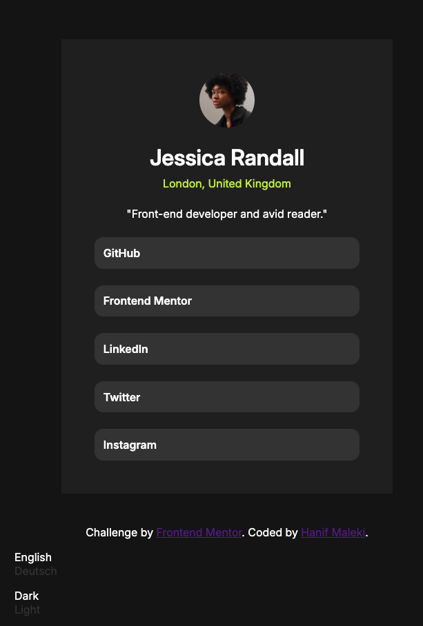

# Frontend Mentor - Social links profile solution

This is a solution to the [Social links profile challenge on Frontend Mentor](https://www.frontendmentor.io/challenges/social-links-profile-UG32l9m6dQ). Frontend Mentor challenges help you improve your coding skills by building realistic projects. 

## Table of contents

- [Overview](#overview)
  - [The challenge](#the-challenge)
  - [Screenshot](#screenshot)
  - [Links](#links)
- [My process](#my-process)
  - [Built with](#built-with)
  - [What I learned](#what-i-learned)
  - [Continued development](#continued-development)
- [Author](#author)

## Overview

### The challenge

Users should be able to:

- See hover and focus states for all interactive elements on the page

### Screenshot



### Links

- Solution URL: [Solution URL](https://github.com/hanifmaleki/Social-Profile)
- Live Site URL: [Live URL](https://hanifmaleki.github.io/Social-Profile)

## My process

### Built with
- Semantic **HTML5** markup  
- **CSS custom properties**  
- **Flexbox**  
- **CSS Grid**  
- **Mobile-first workflow**  
- **Pug** template language  
- **SCSS** (with variables and mixins)  
- **GitHub Actions** (for CI/CD pipeline)  
- **GitHub Pages** (for deployment)  
- **Neovim** (as main editor)  
- **i18 translations**
- **npm scripts** (`copy-js`)  
- [chokidar-cli](https://github.com/open-cli-tools/chokidar-cli)

### What I learned

In this project, I implemented client-side internationalization (i18n) and provided a language selector in the UI that allows users to change the site’s language dynamically.

```pug
.language-container(id='LanguageSelector') 
    ul.languages
        each language in languages 
            li(id=language.code)= language.name
```

```js
class LanguageSelector {
    constructor(container) {
        this.element = container
        this.list = container.querySelector('ul')
        this.languages = this.list.querySelectorAll('li')
        this.currentLanguageCode = document.documentElement.lang
        
        this.languages.forEach(languageItem => {
            if (languageItem.id === this.currentLanguageCode) {
                languageItem.classList.add('selected')
                this.currentLanguageItem = languageItem
            }

            languageItem.addEventListener('click', event => this.onChangeLanguage(event, languageItem))
        })
    }

    onChangeLanguage(event, languageItem) {
        if (languageItem.id === this.currentLanguageCode) {
            return
        }

        this.currentLanguageItem.classList.remove('selected')
        this.currentLanguageItem = languageItem 
        this.currentLanguageCode = languageItem.id 
        languageItem.classList.add('selected')
        document.documentElement.lang = languageItem.id
        render()
    }
}
```

I also added a __theme switcher__, allowing users to toggle between **dark** and **light** themes.

```pug
.theme-selector-container(id='ThemeSelector') 
    ul.themes-list 
        li(id="dark" data-i18n="dark")
        li(id="light" data-i18n="light")
```

```js
class ThemeSelector {
    constructor(container) {
        this.element = container 
        this.darkElement = container.querySelector('#dark')
        this.lightElement = container.querySelector('#light')
        this.selectedThem = this.darkElement 
        this.selectedThem.classList.add('selected')
        
        this.darkElement.addEventListener('click', event => this.onChangeTheme(event, this.darkElement))
        this.lightElement.addEventListener('click', event => this.onChangeTheme(event, this.lightElement))
    }

    onChangeTheme(event, themeItem) {
        console.log('on change theme', themeItem)
        if (themeItem.id === this.selectedThem.id) {
            return
        }

        this.selectedThem.classList.remove('selected')
        this.selectedThem = themeItem
        this.selectedThem.classList.add('selected')
        document.documentElement.setAttribute('data-theme', this.selectedThem.id)
    }
}
```

To support theming, I used CSS custom properties layered over SCSS variables, allowing for flexible theme switching at runtime:

```scss
// Colors 
:root {
    --color-primary: hsl(75, 94%, 57%); /* green*/
    --color-text: hsl(0, 0%, 100%); /* white */

    --color-bg: hsl(0, 0%, 20%); /* gray 700 */
    --color-surface: hsl(0, 0%, 12%); /* gray 800 */
    --color-surface-alt: hsl(0, 0%, 8%); /* gray 900 */
}

[data-theme="light"] {
  --color-primary: hsl(75, 94%, 40%);   /* slightly darker green for contrast */
  --color-text: hsl(0, 0%, 10%);        /* dark text */

  --color-bg: hsl(0, 0%, 98%);          /* light gray body background */
  --color-surface: hsl(0, 0%, 100%);    /* card background = pure white */
  --color-surface-alt: hsl(0, 1%, 72%); /* button background = subtle gray */
}

// SCSS variables reference CSS variables
$primary: var(--color-primary);
$text: var(--color-text);

$bg: var(--color-bg);
$surface: var(--color-surface);
$surface-alt: var(--color-surface-alt);
```

### Continued development
In future projects, I plan to:
- Improve the language selector with country flags and better visual design.
- Refine the theme selector for smoother transitions and more customization options.
- Modularize both selectors into reusable JS components.
- Split the main JavaScript file into multiple ES modules.
- Introduce Webpack for better build management and bundling.

## Author

- Frontend Mentor - [@hanifmaleki](https://www.frontendmentor.io/profile/hanifmaleki)


